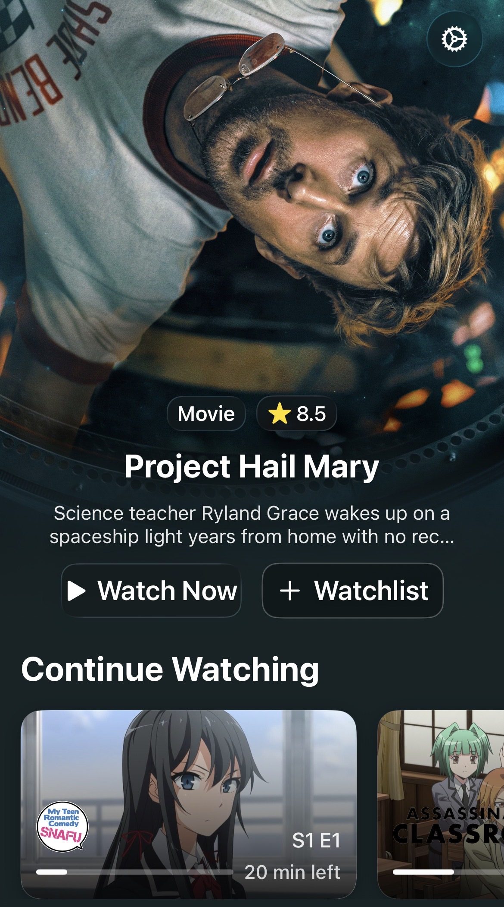
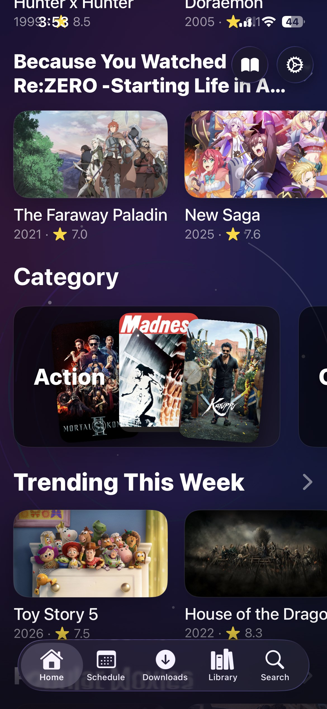
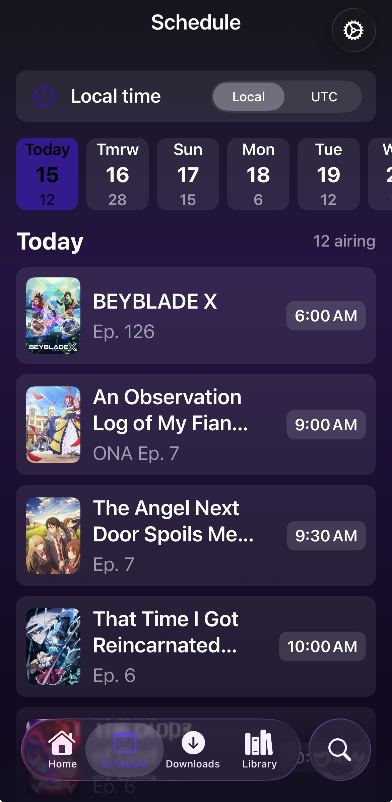
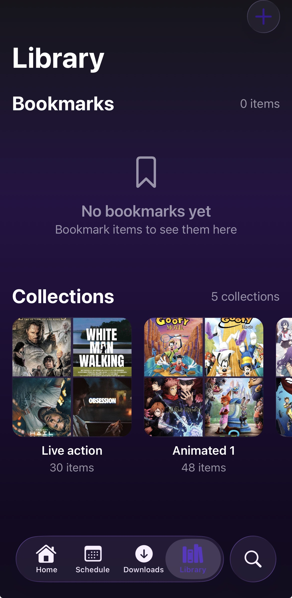
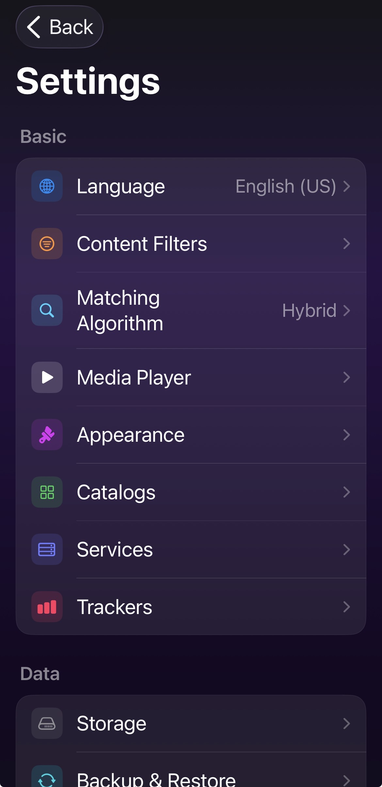

# Eclipse

<p align="center">
  <strong>A media hub for anime, movies, shows, manga, light novels, downloads, tracker sync, and in-app playback.</strong>
</p>

<p align="center">
  <a href="https://github.com/Soupy-dev/Eclipse/releases">
    
  </a>
  <a href="https://www.patreon.com/soupy698">
    
  </a>
</p>

<p align="center">
  <a href="#preview">Preview</a> |
  <a href="#screenshots">Screenshots</a> |
  <a href="#features">Features</a> |
  <a href="#install">Install</a> |
  <a href="#build-configuration">Build</a> |
  <a href="#license">License</a>
</p>

## Why Eclipse

Eclipse was designed to bridge Luna services (more well known as Sora modules) with Stremio addons in one polished app. The goal is simple: search faster, pick the right result with better metadata, watch with stronger controls, keep progress synced, and continue across anime, movies, shows, manga, and novels. Now powered by Aidoku as well. Star the repo or support on Patreon if you like my work!

## Screenshots

<table>
  <tr>
    <td align="center"></td>
    <td align="center"></td>
    <td align="center"></td>
    <td align="center"></td>
    <td align="center"></td>
  </tr>
  <tr>
    <td align="center"><strong>Home</strong><br>Featured picks and continue watching</td>
    <td align="center"><strong>Discover</strong><br>Catalog rows and rich posters</td>
    <td align="center"><strong>Schedule</strong><br>Local and UTC anime air times</td>
    <td align="center"><strong>Library</strong><br>Bookmarks and custom collections</td>
    <td align="center"><strong>Settings</strong><br>Playback, services, trackers, and backups</td>
  </tr>
</table>


## Features

- Anime, movie, and TV discovery powered by TMDB and AniList metadata
- User-controlled catalogs from TMDB and AniList
- Continue Watching with smarter TMDB and AniList matching
- AniList, MyAnimeList, and Trakt tracker support
- Manga library support with reading progress, collections, and tracker sync
- Light novel support
- Stremio addon support for stream discovery
- Downloads with HLS support
- Backup and restore
- Automatic cache cleanup
- User ratings and private notes
- Anime schedule integration through AniList
- Western schedule by trakt
- MPV playback with subtitle defaults, language defaults, next episode actions, AniSkip, IntroDB, and TheIntroDB support
- A redesigned interface built around browsing, watching, reading, and managing progress
- Customizable UI
- And more!

## Install

Get the TestFlight build (Recommended for most iOS users, easiest to download and update):

https://testflight.apple.com/join/FDXvrxVg

AltStore and SideStore users can add this source:

```text
https://raw.githubusercontent.com/Soupy-dev/Eclipse/main/altsource.json
```

## Notes

- MPV is the advanced in-app player and is default
- VLC is not supported anymore, but may come back if v4 is good.
- Use GitHub Issues for feature requests and bug reports.
- Development started in December 2025
- Patreon is available if you want to support development: https://www.patreon.com/soupy698 but it will never unlock features or paywall anything. It's just a way to support development if you want to. And no, ads/telemetry will never be a thing in this app, so you don't have to worry about that either.


## License

Eclipse is released under the GNU General Public License version 3. See `LICENSE`.

The original Luna project is available at `https://github.com/cranci1/Luna`.

Source code for builds distributed from this repository is available at `https://github.com/Soupy-dev/Eclipse`. If you redistribute an IPA or another binary, provide the corresponding source under GPLv3.

Credits to https://github.com/Aidoku/Aidoku for powering Reader Mode.

This program comes with no warranty, to the extent permitted by law.

## Bring Your Own Sources

Eclipse ships as an app shell and media manager. It does not provide hosted media, built-in piracy sources, or bundled addons.

Users are responsible for the services and addons they choose to add. The app and developer do not support piracy.

To add a service/addon, click the top right settings icon in the homescreen and then click services. Then click the top right plus icon and choose whichever type of link you copied.


## Build Configuration

Secrets and API keys are loaded from ignored local configuration files instead of tracked source files.

For iOS, copy `Build.local.xcconfig.example` to `Build.local.xcconfig` and fill in the values you need.

Configured keys include:

- `TMDB_API_KEY`
- `ANILIST_CLIENT_ID`
- `ANILIST_CLIENT_SECRET`
- `TRAKT_CLIENT_ID`
- `TRAKT_CLIENT_SECRET`
- `MAL_CLIENT_ID`
- `MAL_CLIENT_SECRET`
